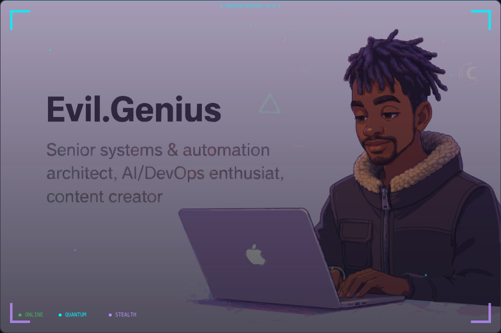
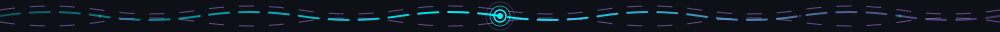
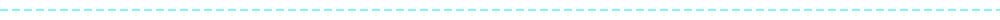
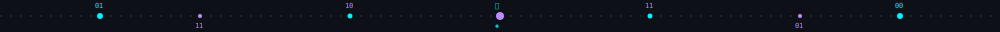
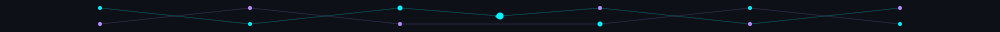
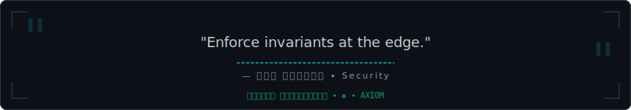

<!--
  ╔═══════════════════════════════════════════════════════════════════════════╗
  ║  POPDEUXREM // QUANTUM SURFACE v12.0                                      ║
  ║  AUTO-GENERATED BY build_readme.py                                        ║
  ║  LAST SYNC: 2026-02-21T20:07:10Z | SHA: 49f2eb37858ef4a0               ║
  ╚═══════════════════════════════════════════════════════════════════════════╝
 -->

<div align="center">

<!-- ═══════════════════════════════════════════════════════════════════════════
     HERO SURFACE v12.0 // IMMERSIVE ORBITAL IDENTITY
     ═══════════════════════════════════════════════════════════════════════════ -->

<picture>
  <source media="(prefers-color-scheme: dark)" srcset="assets/hero_banner.svg">
  <source media="(prefers-color-scheme: light)" srcset="assets/hero_banner.svg">
  
</picture>

<a name="header"></a>


<br/><br/>


<br/>

<!-- ═══════════════════════════════════════════════════════════════════════════
     NAVIGATION
     ═══════════════════════════════════════════════════════════════════════════ -->

<code>
<a href="#about">ABOUT</a> · <a href="#terminal">TERMINAL</a> · <a href="#stack">STACK</a> · <a href="#stats">STATS</a> · <a href="#connect">CONNECT</a>
</code>



<!-- ═══════════════════════════════════════════════════════════════════════════
     OPERATOR CORE v12.0 // LIVING JAVASCRIPT OBJECT
     ═══════════════════════════════════════════════════════════════════════════ -->

<a name="about"></a>

<div align="center">



</div>

<br/>

### ◈ ꛎꔪ𖣠ꚶ𖢧 𖢑𖤢 ◈

```javascript
/**
 * ╔═══════════════════════════════════════════════════════════════════════════╗
 * ║  POPDEUXREM :: CLASSIFIED DOSSIER v2.0                                    ║
 * ║  SYNC: 2026-02-21T21:00:00Z | SHA: a3f8c2d1e9b7 | CLEARANCE: TS/SCI//QUANTUM             ║
 * ╚═══════════════════════════════════════════════════════════════════════════╝
 */

const dossier = {
  
  classification: {
    level: 'TS/SCI//QUANTUM',
    fileRef: 'PDR-████-████-ARCH',
    subject: '████████████████ aka @popdeuxrem',
    accessGranted: '██/██/████',
    authorizedBy: '████████████',
    status: 'ACTIVE · ONLINE · [REDACTED]'
  },

  identity: {
    handle: '𖢧ꛅ𖤢 ꚽꚳꛈ𖢧ꛕꛅ',
    alias: '@d3_glitch',
    designation: 'PRINCIPAL SYSTEMS ARCHITECT',
    clearance: 'QUANTUM_STEALTH',
    mode: 'QUANTUM',
    uptime: '∞',
    lastVerified: new Date().toISOString()
  },

  directive: {
    primary: 'COMPOSABLE',
    secondary: 'REVERSIBLE',
    tertiary: 'AUDITABLE',
    payload: 'see operator definition → popdeuxrem.js'
  },

  redacted: [
    '██████████████████████████████████████',
    '████████████████ [CLASSIFIED] ████████',
    '██████████████████████████████████████'
  ]

};

export default dossier; // ◈ Classified. Redacted. Quantum-grade.
```


<!-- ═══════════════════════════════════════════════════════════════════════════
     TERMINAL v12.0 // DYNAMIC SVG WITH LIVE PARTICLES
     ═══════════════════════════════════════════════════════════════════════════ -->

<a name="terminal"></a>

### ◈ 𖢧𖤢𖦪𖢑ꛈꛘꛎꚳ ◈

<picture>
  <source media="(prefers-color-scheme: dark)" srcset="assets/terminal-dynamic.svg">
  
</picture>



<!-- ═══════════════════════════════════════════════════════════════════════════
     PROXY MESH :: FEATURED ARTIFACT
     ═══════════════════════════════════════════════════════════════════════════ -->

<a name="proxy"></a>

### ◈ ꛤ𖦪ꛣ𖤗ꚲ 𖢑𖤢ꕷꛅ ◈

<div align="center">

<a href="https://github.com/popdeuxrem/shadow-scripts">
  
</a>


</div>

<br/>

> **Proxy meshes, DNS overlays, stealth routing, iOS Shortcuts operators, n8n/Docker pipelines.**

<a name="shadow"></a>

<details>
<summary><b>◈ ꕷꛅꛎ𖤀𖣠ꛃ_ꛕ𖣠𖦪𖤢 ◈</b></summary>

<br/>

```typescript
/**
 * ╔═══════════════════════════════════════════════════════════════════════════╗
 * ║  POPDEUXREM :: OPERATIONAL MANIFEST v12.0                                 ║
 * ║  SYNC: 2026-02-21T20:07:10Z | SHA: manifest.shadow.stable                 ║
 * ╚═══════════════════════════════════════════════════════════════════════════╝
 */

interface OperatorManifest {
  operator: {
    id: "POPDEUXREM";
    clearance: "PRINCIPAL | SYS_ADMIN";
    mode: "QUANTUM_STEALTH";
    directive: "COMPOSABLE + REVERSIBLE + AUDITABLE";
  };
  
  coreAxioms: [
    "Determinism first",
    "Observability is currency",
    "iOS automation (Shortcuts/Scriptable) eliminates toil",
    "Proxy meshes + shadow routing for infrastructure hardening",
    "Every system is reversible and auditable"
  ];
  
  stack: {
    primary: ["JavaScript", "TypeScript", "React", "Node.js", "Python"];
    infrastructure: ["Docker", "Kubernetes", "Terraform", "n8n", "Pulumi"];
    automation: ["iOS Shortcuts", "Scriptable", "Data Jar", "GitHub Actions"];
    observability: ["Cloudflare", "Redis", "PostgreSQL", "AWS"];
  };
  
  philosophy: string;
}

const manifest: OperatorManifest = {
  operator: {
    id: "POPDEUXREM",
    clearance: "PRINCIPAL | SYS_ADMIN",
    mode: "QUANTUM_STEALTH",
    directive: "COMPOSABLE + REVERSIBLE + AUDITABLE"
  },
  
  coreAxioms: [
    "Determinism first",
    "Observability is currency",
    "iOS automation (Shortcuts/Scriptable) eliminates toil",
    "Proxy meshes + shadow routing for infrastructure hardening",
    "Every system is reversible and auditable"
  ],
  
  stack: {
    primary: ["JavaScript", "TypeScript", "React", "Node.js", "Python"],
    infrastructure: ["Docker", "Kubernetes", "Terraform", "n8n", "Pulumi"],
    automation: ["iOS Shortcuts", "Scriptable", "Data Jar", "GitHub Actions"],
    observability: ["Cloudflare", "Redis", "PostgreSQL", "AWS"]
  },
  
  philosophy: "Building quantum-grade infrastructure that fails gracefully, scales infinitely, tells you when it's unhappy. Complexity is debt. Observability is currency."
};

export default manifest; // ◈ Reversible. Auditable. Shadow-grade.
```

</details>



<!-- ═══════════════════════════════════════════════════════════════════════════
     TECH MATRIX v12.0 // NEON CARD GRID
     ═══════════════════════════════════════════════════════════════════════════ -->
<a name="stack"></a>
<div align="center">

### ◈ 𖢧𖤢ꛕꛅ ꕷ𖢧ꛎꛕ𖢉 ◈

<br/>

<table>
<tr>
<td valign="top" width="33%">

<h3 align="center">🧰 ꘘ𖦪𖣠ꛘ𖢧𖤢ꛘ𖤀</h3>
<p align="center">
<br/>

<br/>

<br/>

<br/>

<br/>

<br/>


</p>

</td>
<td valign="top" width="33%">

<h3 align="center">⚙️ ꔪꛎꛕ𖢉𖤢ꛘ𖤀</h3>
<p align="center">

<br/>

<br/>

<br/>

<br/>


</p>

</td>
<td valign="top" width="33%">

<h3 align="center">🔬 ꛈꛘꘘ𖦪ꛎ</h3>
<p align="center">

<br/>

<br/>

<br/>

<br/>


</p>

</td>
</tr>
</table>

</div>



<!-- ═══════════════════════════════════════════════════════════════════════════
     TELEMETRY v12.0 // SNAKE CONTRIBUTION MATRIX
     ═══════════════════════════════════════════════════════════════════════════ -->
<a name="stats"></a>
<div align="center">

### ◈ 𖢧𖤢ꚳ𖤢𖢑𖤢𖢧𖦪ꚲ ◈

<br/>


<br/><br/>

<picture>
  <source media="(prefers-color-scheme: dark)" srcset="dist/github-snake-dark.svg">
  
</picture>

</div>


<!-- ═══════════════════════════════════════════════════════════════════════════
     UPLINK v12.0 // IMMERSIVE CONNECT CONSOLE
     ═══════════════════════════════════════════════════════════════════════════ -->

<a name="connect"></a>

### 🤝 ꛕ𖣠ꛘꛘ𖤢ꛕ𖢧 ꛃꛈ𖢧ꛅ 𖢑𖤢

<div align="center">

```
⟁ ORBIT // UPLINK

╭────────────────────────────────────────────────────────────╮
│ 🛰 GitHub → https://github.com/Popdeuxrem                  │
│ ✉ DM (X) → https://x.com/d3_glitch                        │
│                                                            │
│ 📓 Quantum Lab → https://github.com/Popdeuxrem/quantum-lab │
│ 📧 Email → mailto:contact@popdeuxrem@email                 │
╰────────────────────────────────────────────────────────────╯

Transmission Schema
context · constraints · ideal_outcome
```

</div>


<!-- ═══════════════════════════════════════════════════════════════════════════
     AXIOM v12.0 // QUANTUM QUOTE SURFACE
     ═══════════════════════════════════════════════════════════════════════════ -->

<a name="quote"></a>
<picture>
  <source media="(prefers-color-scheme: dark)" srcset="assets/section_quote.svg">
  <source media="(prefers-color-scheme: light)" srcset="assets/section_quote.svg">
  
</picture>

<br/><br/>

---

<p align="center">
  🧿 Updated daily by <code>build_readme.py</code> • 🧬 Maintained by <code>𖢧ꛅ𖤢 ꚽꚳꛈ𖢧ꛕꛅ</code>
</p>

<p align="center">
  
</p>

</div>
