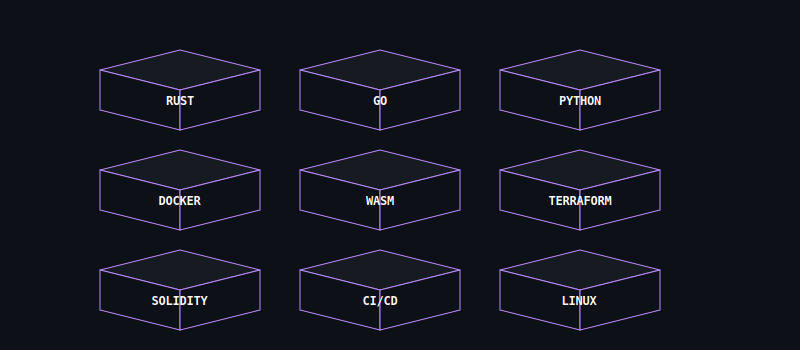

<!-- 
    GENERATED BY SPECTRE v5.0 DESIGN ENGINE 
    DO NOT EDIT MANUALLY - EXECUTE scripts/update_readme.py
-->

<!-- 1. NAVIGATION INDEX -->
<code>
[ THESIS ](#thesis) · [ STACK ](#stack) · [ WORK ](#work) · [ TELEMETRY ](#telemetry) · [ SECURITY ](#security)
</code>

  

<!-- 2. HERO / IDENTITY (Dominant Anchor) -->

  

<!-- 3. ENGINEERING THESIS (Quiet / Static) -->

 

<!-- 4. OPERATIONAL STACK (Structural) -->

 

<!-- 5. WORK / DEPLOYMENTS (Flow) -->

 

<!-- 6. TELEMETRY (Ambient Monitoring) -->

 

<!-- 7. SECURITY STATUS (Binary Pass/Fail) -->

  

<!-- 8. UPLINK / CONTACT -->

### ◈ UPLINK_ESTABLISHED

| PROTOCOL | ENDPOINT | SLA |
| :--- | :--- | :--- |
| **SMTP** | `popdeuxrem@gateway.net` | `< 24H` |
| **GPG** | `0xSPECTRE_KEY` | `ENCRYPTED_ONLY` |
| **MATRIX** | `@popdeuxrem:matrix.org` | `REALTIME` |

 

<!-- 9. FOOTER SIGNATURE (Cryptographic Finality) -->
---

    <code>BUILD: Surface/v5 · 2026-01-31 01:45 UTC · SHA256:36dcad9e · invariant</code>

