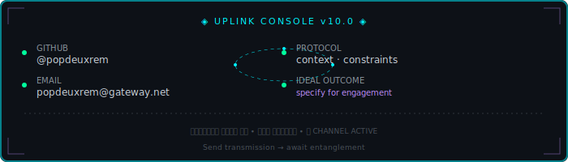

<!--
  ╔═══════════════════════════════════════════════════════════════════════════╗
  ║  POPDEUXREM // QUANTUM SURFACE v10.0                                      ║
  ║  AUTO-GENERATED BY build_readme.py                                        ║
  ║  LAST SYNC: 2026-02-21T16:50:26Z | SHA: 49f2eb37858ef4a0               ║
  ╚═══════════════════════════════════════════════════════════════════════════╝
 -->

<div align="center">

<!-- ═══════════════════════════════════════════════════════════════════════════
     HERO SURFACE v10.0 // IMMERSIVE ORBITAL IDENTITY
     ═══════════════════════════════════════════════════════════════════════════ -->

<picture>
  <source media="(prefers-color-scheme: dark)" srcset="assets/hero_banner.svg">
  <source media="(prefers-color-scheme: light)" srcset="assets/hero_banner.svg">
  
</picture>

<br/>

<a name="header"></a>


      <stop offset="50%" stop-color="#00f3ff" stop-opacity="1"/>
      <stop offset="100%" stop-color="#bc8cff" stop-opacity="0"/>
    </linearGradient>
    <linearGradient id="title-grad" x1="0%" y1="0%" x2="100%" y2="100%">
      <stop offset="0%" stop-color="#00f3ff"/>
      <stop offset="50%" stop-color="#bc8cff"/>
      <stop offset="100%" stop-color="#00ff9d"/>
    </linearGradient>
    <filter id="glow-heavy" x="-100%" y="-100%" width="300%" height="300%">
      <feGaussianBlur stdDeviation="4" result="blur"/>
      <feMerge><feMergeNode in="blur"/><feMergeNode in="blur"/><feMergeNode in="SourceGraphic"/></feMerge>
    </filter>
    <filter id="glow-soft" x="-50%" y="-50%" width="200%" height="200%">
      <feGaussianBlur stdDeviation="2" result="blur"/>
      <feMerge><feMergeNode in="blur"/><feMergeNode in="SourceGraphic"/></feMerge>
    </filter>
  </defs>
  
  <style>
    .bg { fill: #0d1117; }
    .grid { stroke: #30363d; stroke-width: 0.5; opacity: 0.3; }
    .matrix { font-family: monospace; font-size: 9px; fill: #00f3ff; opacity: 0.08; }
    
    .title-fancy { 
      font-family: 'Playfair Display', 'Bodoni MT', 'Didot', 'Times New Roman', Georgia, serif; 
      font-weight: 900; 
      font-style: italic;
      font-size: 52px; 
      letter-spacing: 6px;
      fill: url(#title-grad);
      filter: url(#glow-heavy);
    }
    
    .subtitle { font-family: 'SF Mono', 'Fira Code', monospace; font-size: 11px; letter-spacing: 4px; fill: #bc8cff; }
    .status { font-family: 'SF Mono', monospace; font-size: 9px; fill: #8b949e; }
    
    .orbit { fill: none; stroke-width: 1.5; opacity: 0.4; }
    .orbit-1 { stroke: #00f3ff; animation: spin-orbit 20s linear infinite; transform-origin: 500px 90px; }
    .orbit-2 { stroke: #bc8cff; animation: spin-orbit 15s linear infinite reverse; transform-origin: 500px 90px; }
    .orbit-3 { stroke: #00ff9d; animation: spin-orbit 25s linear infinite; transform-origin: 500px 90px; }
    @keyframes spin-orbit { from { transform: rotate(0deg); } to { transform: rotate(360deg); } }
    
    .particle { fill: #00f3ff; animation: float 3s ease-in-out infinite; }
    .particle-m { fill: #bc8cff; animation: float 3s ease-in-out infinite reverse; }
    .particle-g { fill: #00ff9d; animation: float 3s ease-in-out infinite; }
    @keyframes float { 0%,100% { transform: translateY(0); } 50% { transform: translateY(-8px); } }
    
    .pulse-dot { animation: pulse-dot 2s ease-in-out infinite; }
    @keyframes pulse-dot { 0%,100% { r: 3; opacity: 1; } 50% { r: 5; opacity: 0.6; } }
    
    .scanline { fill: #00f3ff; opacity: 0.03; animation: scan 4s linear infinite; }
    @keyframes scan { 0% { transform: translateY(-180px); } 100% { transform: translateY(180px); } }
    
    .data-stream { font-family: monospace; font-size: 7px; fill: #00f3ff; opacity: 0.15; animation: stream 2s linear infinite; }
    @keyframes stream { 0% { opacity: 0.05; } 50% { opacity: 0.2; } 100% { opacity: 0.05; } }
    
    .reveal { opacity: 0; animation: reveal 1.5s ease-out forwards; }
    .reveal-1 { animation-delay: 0.3s; }
    .reveal-2 { animation-delay: 0.8s; }
    .reveal-3 { animation-delay: 1.3s; }
    @keyframes reveal { to { opacity: 1; } }
    
    @media (prefers-color-scheme: light) {
      .bg { fill: #f6f8fa; }
      .grid { stroke: #d0d7de; }
      .matrix { fill: #0969da; }
      .title-fancy { fill: #0969da; filter: none; }
      .subtitle { fill: #8250df; }
    }
    
    @media (prefers-reduced-motion: reduce) {
      .orbit, .particle, .pulse-dot, .scanline, .data-stream, .reveal { animation: none; opacity: 1; }
    }
  </style>
  
  <rect class="bg" width="1000" height="180"/>
  
  <g class="grid">
    <line x1="0" y1="30" x2="1000" y2="30"/><line x1="0" y1="60" x2="1000" y2="60"/>
    <line x1="0" y1="90" x2="1000" y2="90"/><line x1="0" y1="120" x2="1000" y2="120"/>
    <line x1="0" y1="150" x2="1000" y2="150"/>
    <line x1="100" y1="0" x2="100" y2="180"/><line x1="200" y1="0" x2="200" y2="180"/>
    <line x1="300" y1="0" x2="300" y2="180"/><line x1="400" y1="0" x2="400" y2="180"/>
    <line x1="500" y1="0" x2="500" y2="180"/><line x1="600" y1="0" x2="600" y2="180"/>
    <line x1="700" y1="0" x2="700" y2="180"/><line x1="800" y1="0" x2="800" y2="180"/>
    <line x1="900" y1="0" x2="900" y2="180"/>
  </g>
  
  <g class="matrix">
    <text x="20" y="25">01010010</text><text x="120" y="45">10110101</text><text x="220" y="35">01101001</text>
    <text x="320" y="55">11010010</text><text x="620" y="25">00101101</text><text x="720" y="45">10010110</text>
    <text x="820" y="35">01110011</text><text x="920" y="55">11001010</text>
  </g>
  
  <rect class="scanline" x="0" y="0" width="1000" height="3"/>
  
  <g transform="translate(500, 90)">
    <ellipse class="orbit orbit-1" cx="0" cy="0" rx="280" ry="60"/>
    <ellipse class="orbit orbit-2" cx="0" cy="0" rx="220" ry="45"/>
    <ellipse class="orbit orbit-3" cx="0" cy="0" rx="160" ry="30"/>
  </g>
  
  <g filter="url(#glow-soft)">
    <circle class="particle pulse-dot" cx="220" cy="90" r="3" style="animation-delay:0s"/>
    <circle class="particle-m pulse-dot" cx="280" cy="45" r="2" style="animation-delay:0.4s"/>
    <circle class="particle-g pulse-dot" cx="720" cy="135" r="2.5" style="animation-delay:0.8s"/>
    <circle class="particle pulse-dot" cx="780" cy="90" r="3" style="animation-delay:1.2s"/>
    <circle class="particle-m pulse-dot" cx="340" cy="135" r="2" style="animation-delay:1.6s"/>
    <circle class="particle-g pulse-dot" cx="660" cy="45" r="2.5" style="animation-delay:2s"/>
  </g>
  
  <g class="data-stream">
    <text x="50" y="100">⟁ INIT QUANTUM_FLUX</text>
    <text x="750" y="80">◉ SYNC_COMPLETE</text>
    <text x="400" y="165">⬡ PROTOCOL_STACK::LOADED</text>
  </g>
  
  <g class="reveal reveal-1" filter="url(#glow-heavy)">
    <text class="title-fancy" x="500" y="100" text-anchor="middle">𝓟𝓸𝓹𝓓𝓮𝓾𝔁𝓡𝓮𝓶</text>
  </g>
  
  <g class="reveal reveal-2">
    <text class="subtitle" x="500" y="125" text-anchor="middle">PRINCIPAL SYSTEMS ARCHITECT</text>
  </g>
  
  <g class="reveal reveal-3">
    <rect x="50" y="145" width="140" height="22" rx="4" fill="#0d1117" stroke="#00f3ff" stroke-width="1" opacity="0.8"/>
    <text class="status" x="60" y="160">◉ STATUS: ONLINE</text>
    <rect x="200" y="145" width="130" height="22" rx="4" fill="#0d1117" stroke="#bc8cff" stroke-width="1" opacity="0.8"/>
    <text class="status" x="210" y="160">◈ SYNC: ACTIVE</text>
    <rect x="340" y="145" width="150" height="22" rx="4" fill="#0d1117" stroke="#00ff9d" stroke-width="1" opacity="0.8"/>
    <text class="status" x="350" y="160">⬡ MODE: QUANTUM</text>
  </g>
  
  <g class="reveal reveal-3" transform="translate(850, 150)">
    <rect x="0" y="0" width="120" height="22" rx="4" fill="#0d1117" stroke="#30363d" stroke-width="1"/>
    <text class="status" x="10" y="15">v10.0 // surface</text>
  </g>
  
  <line x1="0" y1="178" x2="1000" y2="178" stroke="#30363d" stroke-width="2"/>
  <rect x="0" y="177" width="400" height="3" fill="url(#orbit-grad)">
    <animate attributeName="width" values="0;1000;0" dur="6s" repeatCount="indefinite"/>
  </rect>
</svg>

<br/>


<br/>


<br/>

<!-- ═══════════════════════════════════════════════════════════════════════════
     NAVIGATION
     ═══════════════════════════════════════════════════════════════════════════ -->

<code>
<a href="#about">ABOUT</a> · <a href="#terminal">TERMINAL</a> · <a href="#stack">STACK</a> · <a href="#stats">STATS</a> · <a href="#connect">CONNECT</a>
</code>


<br/><br/>

<!-- ═══════════════════════════════════════════════════════════════════════════
     OPERATOR CORE v10.0 // LIVING JAVASCRIPT OBJECT
     ═══════════════════════════════════════════════════════════════════════════ -->

<a name="about"></a>

<div align="center">


</div>

### ꛎꔪ𖣠ꚶ𖢧 𖢑𖤢

```javascript
/**
 * ╔═══════════════════════════════════════════════════════════════════════════╗
 * ║  POPDEUXREM :: QUANTUM OPERATOR DEFINITION v10.0                          ║
 * ║  SYNC: 2026-02-21T16:50:26Z | SHA: 49f2eb37858ef4a0                    ║
 * ╚═══════════════════════════════════════════════════════════════════════════╝
 */

const popdeuxrem = {
  
  identity: {
    handle: "𖢧ꛅ𖤢 ꚽꚳꛈ𖢧ꛕꛅ",
    alias: "@d3_glitch",
    designation: "PRINCIPAL SYSTEMS ARCHITECT",
    clearance: "QUANTUM_STEALTH"
  },
  
  coreAxioms: [
    "Determinism first — every action must be traceable and reproducible",
    "Observability is currency — systems that can't speak are already broken",
    "iOS automation (Shortcuts/Scriptable/Data Jar) eliminates operational toil",
    "Proxy meshes + shadow routing for infrastructure hardening",
    "Every system is reversible, auditable, and composable by design",
    "Complexity is debt; simplicity is the ultimate sophistication"
  ],
  
  mission: {
    primary: "Design and ship systems that prioritize determinism, observability, and long-term maintainability",
    focus: "Architecture ∙ Automation ∙ Interface-level control",
    philosophy: "Building quantum-grade infrastructure that fails gracefully, scales infinitely, and tells you when it's unhappy"
  },
  
  specializations: [
    { domain: "Systems Architecture", focus: "Composable, reversible designs that survive scale" },
    { domain: "Automation Pipelines", focus: "Remove human fragility from critical workflows" },
    { domain: "Product Infrastructure", focus: "Complex logic made operable and observable" },
    { domain: "iOS Ecosystem", focus: "Shortcuts, Scriptable, Data Jar operators" },
    { domain: "Infrastructure Hardening", focus: "Proxy meshes, DNS overlays, stealth routing" }
  ],
  
  status: {
    operational: "ONLINE",
    sync: "ACTIVE",
    mode: "QUANTUM",
    uptime: "∞",
    lastPing: new Date().toISOString()
  },
  
  uplink: {
    github: "@popdeuxrem",
    email: "popdeuxrem@gateway.net",
    protocol: "Send: context · constraints · ideal outcome"
  },
  
  directive: "ꛤ𖦪ꛈ𖢑ꛎ𖦪ꚲ 𖢧𖤢ꛕꛅꛘ𖣠ꚳ𖣠ꚽꚲ ∙ ꕷ𖤢ꛕ𖣠ꛘ𖤀ꛎ𖦪ꚲ 𖢧𖤢ꛕꛅꛘ𖣠ꚳ𖣠ꚽꚲ ∙ 𖢧𖤢𖦪𖢧ꛈꛎ𖦪ꚲ 𖢧𖤢ꛕꛅꛘ𖣠ꚳ𖣠ꚽꚲ"
  
};

export default popdeuxrem; // ◈ Composable. Reversible. Quantum.
```

<br/><br/>


<br/><br/>

<!-- ═══════════════════════════════════════════════════════════════════════════
     TERMINAL v10.0 // DYNAMIC SVG WITH LIVE PARTICLES
     ═══════════════════════════════════════════════════════════════════════════ -->

<a name="terminal"></a>

<picture>
  <source media="(prefers-color-scheme: dark)" srcset="assets/terminal-dynamic.svg">
  
</picture>

<br/><br/>


<br/><br/>

<!-- ═══════════════════════════════════════════════════════════════════════════
     PROXY MESH :: FEATURED ARTIFACT
     ═══════════════════════════════════════════════════════════════════════════ -->

<a name="proxy"></a>

### ◈ PROXY_MESH :: FEATURED_ARTIFACT

<div align="center">

<a href="https://github.com/popdeuxrem/shadow-scripts">
  
</a>


</div>

> **Proxy meshes, DNS overlays, stealth routing, iOS Shortcuts operators, n8n/Docker pipelines.**

<a name="shadow"></a>

<details>
<summary><b>◈ SHADOW_CORE // EXPAND_OPERATIONAL_PHILOSOPHY</b></summary>

<br/>

```typescript
/**
 * ╔═══════════════════════════════════════════════════════════════════════════╗
 * ║  POPDEUXREM :: OPERATIONAL MANIFEST v10.0                                 ║
 * ║  SYNC: 2026-02-21T16:50:26Z | SHA: manifest.shadow.stable                 ║
 * ╚═══════════════════════════════════════════════════════════════════════════╝
 */

interface OperatorManifest {
  operator: {
    id: "POPDEUXREM";
    clearance: "PRINCIPAL | SYS_ADMIN";
    mode: "QUANTUM_STEALTH";
    directive: "COMPOSABLE + REVERSIBLE + AUDITABLE";
  };
  
  coreAxioms: [
    "Determinism first",
    "Observability is currency",
    "iOS automation (Shortcuts/Scriptable) eliminates toil",
    "Proxy meshes + shadow routing for infrastructure hardening",
    "Every system is reversible and auditable"
  ];
  
  stack: {
    primary: ["JavaScript", "TypeScript", "React", "Node.js", "Python"];
    infrastructure: ["Docker", "Kubernetes", "Terraform", "n8n", "Pulumi"];
    automation: ["iOS Shortcuts", "Scriptable", "Data Jar", "GitHub Actions"];
    observability: ["Cloudflare", "Redis", "PostgreSQL", "AWS"];
  };
  
  philosophy: string;
}

const manifest: OperatorManifest = {
  operator: {
    id: "POPDEUXREM",
    clearance: "PRINCIPAL | SYS_ADMIN",
    mode: "QUANTUM_STEALTH",
    directive: "COMPOSABLE + REVERSIBLE + AUDITABLE"
  },
  
  coreAxioms: [
    "Determinism first",
    "Observability is currency",
    "iOS automation (Shortcuts/Scriptable) eliminates toil",
    "Proxy meshes + shadow routing for infrastructure hardening",
    "Every system is reversible and auditable"
  ],
  
  stack: {
    primary: ["JavaScript", "TypeScript", "React", "Node.js", "Python"],
    infrastructure: ["Docker", "Kubernetes", "Terraform", "n8n", "Pulumi"],
    automation: ["iOS Shortcuts", "Scriptable", "Data Jar", "GitHub Actions"],
    observability: ["Cloudflare", "Redis", "PostgreSQL", "AWS"]
  },
  
  philosophy: "Building quantum-grade infrastructure that fails gracefully, scales infinitely, tells you when it's unhappy. Complexity is debt. Observability is currency."
};

export default manifest; // ◈ Reversible. Auditable. Shadow-grade.
```

</details>


<br/><br/>

<!-- ═══════════════════════════════════════════════════════════════════════════
     TECH MATRIX v10.0 // NEON CARD GRID
     ═══════════════════════════════════════════════════════════════════════════ -->
<a name="stack"></a>
<div align="center">

### ⚡ ꛤ𖦪ꛈ𖢑ꛎ𖦪ꚲ ꕷ𖢧ꛎ𖢧ꛈꕷ𖢧ꛈꛕꕷ

<br/>

<table>
<tr>
<td valign="top" width="33%">

<h3 align="center">🧰 ꛤ𖦪ꛈ𖢑ꛎ𖦪ꚲ 𖢧𖤢ꛕꛅꛘ𖣠ꚳ𖣠ꚽꚲ</h3>
<p align="center">
<br/>

<br/>

<br/>

<br/>

<br/>

<br/>


</p>

</td>
<td valign="top" width="33%">

<h3 align="center">⚙️ ꕷ𖤢ꛕ𖣠ꛘ𖤀ꛎ𖦪ꚲ 𖢧𖤢ꛕꛅꛘ𖣠ꚳ𖣠ꚽꚲ</h3>
<p align="center">

<br/>

<br/>

<br/>

<br/>


</p>

</td>
<td valign="top" width="33%">

<h3 align="center">🔬 𖢧𖤢𖦪𖢧ꛈꛎ𖦪ꚲ 𖢧𖤢ꛕꛅꛘ𖣠ꚳ𖣠ꚽꚲ</h3>
<p align="center">

<br/>

<br/>

<br/>

<br/>


</p>

</td>
</tr>
</table>

</div>

<br/><br/>

<!-- ═══════════════════════════════════════════════════════════════════════════
     TELEMETRY v10.0 // SNAKE CONTRIBUTION MATRIX
     ═══════════════════════════════════════════════════════════════════════════ -->
<a name="stats"></a>
<div align="center">

### 📈 ꚽꛈ𖢧ꛅꚶꔪ ꕷ𖢧ꛎ𖢧ꛈꕷ𖢧ꛈꛕꕷ

<br/>


<br/><br/>

<picture>
  <source media="(prefers-color-scheme: dark)" srcset="dist/github-snake-dark.svg">
  
</picture>

</div>

<br/><br/>


<!-- ═══════════════════════════════════════════════════════════════════════════
     UPLINK v10.0 // IMMERSIVE CONNECT CONSOLE
     ═══════════════════════════════════════════════════════════════════════════ -->

<a name="connect"></a>

<div align="center">



<br/><br/>

<a href="mailto:popdeuxrem@gateway.net">
  
</a>
<a href="https://github.com/popdeuxrem">
  
</a>

</div>

<br/><br/>


<br/><br/>

<!-- ═══════════════════════════════════════════════════════════════════════════
     AXIOM v10.0 // QUANTUM QUOTE SURFACE
     ═══════════════════════════════════════════════════════════════════════════ -->

<a name="quote"></a>
<picture>
  <source media="(prefers-color-scheme: dark)" srcset="assets/section_quote.svg">
  <source media="(prefers-color-scheme: light)" srcset="assets/section_quote.svg">
  
</picture>

<br/><br/>

---

<p align="center">
  🧿 Updated daily by <code>build_readme.py</code> • 🧬 Maintained by <code>𖢧ꛅ𖤢 ꚽꚳꛈ𖢧ꛕꛅ</code>
</p>

<p align="center">
  
</p>

</div>
