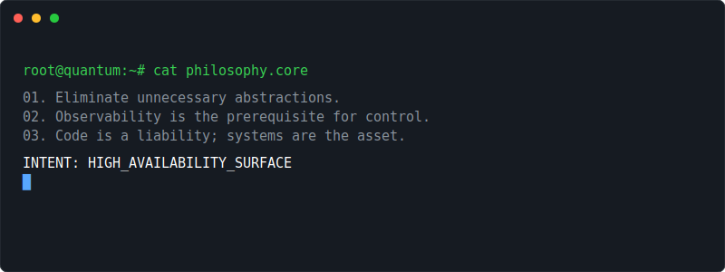
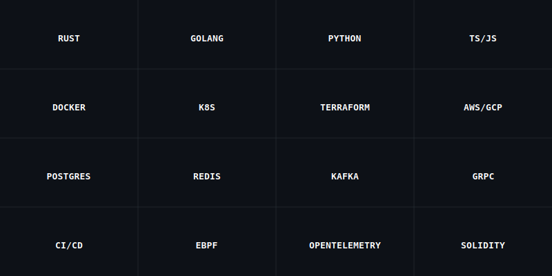
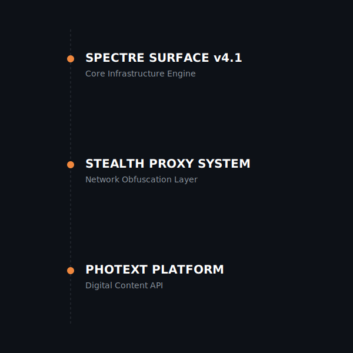
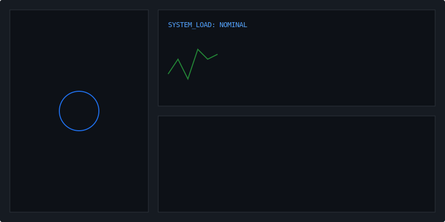
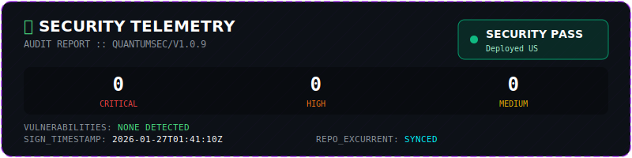

[ THESIS ](#thesis) · [ STACK ](#stack) · [ WORK ](#work) · [ TELEMETRY ](#telemetry) · [ SECURITY ](#security) · [ UPLINK ](#uplink)

**𖢧ꛅ𖤢 ꚽꚳꛈ𖢧ꛕꛅ // PRINCIPAL SYSTEMS ARCHITECT**

---

### ◈ ENGINEERING THESIS

  

---

### ◈ OPERATIONAL STACK

  

---

### ◈ WORK / DEPLOYMENTS

  

| Vessel | Description | Stack | Metrics | Status |
| :--- | :--- | :--- | :--- | :---: |
| **[popdeuxrem](./docs/deployments/popdeuxrem.md)** | PopdeuxRem | `Python` | ⭐ 0 🍴 0 | `ACTIVE` |
| **[iPhone-proxy-system](./docs/deployments/iPhone-proxy-system.md)** | No description provided. | `JavaScript` | ⭐ 0 🍴 0 | `ACTIVE` |
| **[Photext](./docs/deployments/Photext.md)** | No description provided. | `TypeScript` | ⭐ 0 🍴 0 | `ACTIVE` |
| **[pac-host](./docs/deployments/pac-host.md)** | No description provided. | `HTML` | ⭐ 0 🍴 0 | `ACTIVE` |
| **[lysergic-sass](./docs/deployments/lysergic-sass.md)** | No description provided. | `TypeScript` | ⭐ 0 🍴 0 | `ACTIVE` |

---

### ◈ TELEMETRY

  

---

### ◈ SECURITY STATUS

  

> [!CAUTION]
> **🛡️ SEC_AUDIT: DEGRADED | CRIT:0 HIGH:8 | STATUS: BREACH_RISK**

---

### ◈ UPLINK / CONTACT

| PROTOCOL | ENDPOINT | SLA |
| :--- | :--- | :--- |
| SMTP | popdeuxrem@gateway.net | < 24H |
| SOURCE | github.com/popdeuxrem | REALTIME |
| SECURE | PGP: 0xSPECTRE_KEY | CRITICAL_ONLY |

---

`BUILD_SIG: 9b6a221` · `𖢧ꛅ𖤢 ꚽꚳꛈ𖢧ꛕꛅ` · `2026-01-27 07:06:40 UTC`
