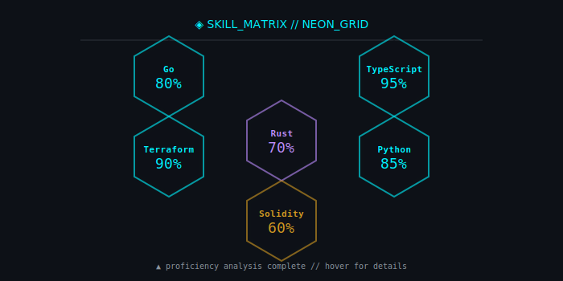

<!--
  ╔═══════════════════════════════════════════════════════════════════════════╗
  ║  POPDEUXREM // QUANTUM SURFACE v6.0                                       ║
  ║  AUTO-GENERATED BY build_readme.py - DO NOT EDIT MANUALLY                 ║
  ║  LAST SYNC: 2026-02-19T00:58:04Z | SHA: 482417cf3dd5cfb8                ║
  ╚═══════════════════════════════════════════════════════════════════════════╝
-->

<div align="center">

<!-- ═══════════════════════════════════════════════════════════════════════════
     SECTION 1: HEADER / IDENTITY
     Design: SVG with SMIL animations, matrix rain, scanlines, boot sequence
     ═══════════════════════════════════════════════════════════════════════════ -->

<a name="header"></a>
<picture>
  <source media="(prefers-color-scheme: dark)" srcset="assets/section_hero.svg">
  <source media="(prefers-color-scheme: light)" srcset="assets/section_hero.svg">
  
</picture>

<br/><br/>

<!-- ═══════════════════════════════════════════════════════════════════════════
     SECTION 2: NAVIGATION INDEX
     Design: Inline code badge with neon separators
     ═══════════════════════════════════════════════════════════════════════════ -->

<code>
<a href="#uplink">UPLINK</a> · <a href="#thesis">THESIS</a> · <a href="#shadow">SHADOW</a> · <a href="#stack">STACK</a> · <a href="#skills">SKILLS</a> · <a href="#proxy">PROXY</a> · <a href="#work">WORK</a> · <a href="#telemetry">TELEMETRY</a> · <a href="#protocol">PROTOCOL</a> · <a href="#timeline">TIMELINE</a> · <a href="#security">SECURITY</a>
</code>

<br/><br/>

<!-- ═══════════════════════════════════════════════════════════════════════════
     SECTION 3: UPLINK COMMS
     Design: Raw Markdown table with inline neon badges + status indicators
     ═══════════════════════════════════════════════════════════════════════════ -->

<a name="uplink"></a>

### ◈ UPLINK_ESTABLISHED

| PROTOCOL | ENDPOINT | STATUS | LATENCY |
|:--------:|:--------:|:------:|:-------:|
|  | `popdeuxrem@gateway.net` |  | `< 24h` |
|  | `0xSPECTRE_KEY` |  | `ASYNC` |
|  | `@popdeuxrem:matrix.org` |  | `< 1s` |

<br/>

<!-- ═══════════════════════════════════════════════════════════════════════════
     SECTION 4: QUANTUM THESIS
     Design: SVG with quantum notation, wave patterns, split-panel
     ═══════════════════════════════════════════════════════════════════════════ -->

<a name="thesis"></a>
<picture>
  <source media="(prefers-color-scheme: dark)" srcset="assets/section_thesis.svg">
  <source media="(prefers-color-scheme: light)" srcset="assets/section_thesis.svg">
  
</picture>

<br/>

<!-- ═══════════════════════════════════════════════════════════════════════════
     SECTION 5: SHADOW CORE (ABOUT)
     Design: Expandable <details> with ASCII terminal, glitch text
     ═══════════════════════════════════════════════════════════════════════════ -->

<a name="shadow"></a>

<details>
<summary><b>◈ SHADOW_CORE // EXPAND_OPERATIONAL_PHILOSOPHY</b></summary>

<br/>

```
    ╔══════════════════════════════════════════════════════════════╗
    ║  ▓▓▓  POPDEUXREM OPERATIONAL MANIFEST v2.0  ▓▓▓              ║
    ╠══════════════════════════════════════════════════════════════╣
    ║                                                              ║
    ║  [OPERATOR_ID]     :: POPDEUXREM                             ║
    ║  [CLEARANCE]       :: PRINCIPAL // SYS_ADMIN                 ║
    ║  [OPERATIONAL_MODE]:: QUANTUM_STEALTH                        ║
    ║  [PRIMARY_DIRECTIVE]:: INFRASTRUCTURE_HARDENING              ║
    ║                                                              ║
    ╠══════════════════════════════════════════════════════════════╣
    ║  CORE AXIOMS:                                                ║
    ║  ─────────────────────────────────────────────────────────── ║
    ║  ▸ Observability is non-negotiable                           ║
    ║  ▸ Fail gracefully, recover instantly                         ║
    ║  ▸ Security through transparency, not obscurity              ║
    ║  ▸ Automation eliminates toil, creates leverage              ║
    ║  ▸ Every system tells a story — make it readable             ║
    ║                                                              ║
    ╠══════════════════════════════════════════════════════════════╣
    ║  SPECIALIZATIONS:                                            ║
    ║  ─────────────────────────────────────────────────────────── ║
    ║  ▸ Distributed Systems Architecture                           ║
    ║  ▸ Infrastructure as Code (Terraform/Pulumi)                 ║
    ║  ▸ Cloud-Native Observability Stacks                         ║
    ║  ▸ Secure CI/CD Pipeline Engineering                         ║
    ║  ▸ AI/ML Infrastructure Orchestration                        ║
    ║                                                              ║
    ╠══════════════════════════════════════════════════════════════╣
    ║  OPERATIONAL_STATUS: ████████████████████ 100% OPERATIONAL   ║
    ╚══════════════════════════════════════════════════════════════╝
```

**OPERATIONAL MODE:**
> Building quantum-grade infrastructure that fails gracefully, scales infinitely, 
> and tells you when it's unhappy. Complexity is debt. Observability is currency.

</details>

<br/>

<!-- ═══════════════════════════════════════════════════════════════════════════
     SECTION 6: TECH STACK MATRIX
     Design: Terminal window with animated progress bars
     ═══════════════════════════════════════════════════════════════════════════ -->

<a name="stack"></a>
<picture>
  <source media="(prefers-color-scheme: dark)" srcset="assets/section_stack.svg">
  <source media="(prefers-color-scheme: light)" srcset="assets/section_stack.svg">
  
</picture>

<br/>

<!-- ═══════════════════════════════════════════════════════════════════════════
     SECTION 7: NEON SKILLS GRID
     Design: SVG hexagonal grid with radial progress + neon glow
     ═══════════════════════════════════════════════════════════════════════════ -->

<a name="skills"></a>
<picture>
  <source media="(prefers-color-scheme: dark)" srcset="assets/skills-neon.svg">
  <source media="(prefers-color-scheme: light)" srcset="assets/skills-neon.svg">
  
</picture>

<br/>

<!-- ═══════════════════════════════════════════════════════════════════════════
     SECTION 8: PROXY MESH (SHADOW-SCRIPTS FEATURED)
     Design: Featured project spotlight card with gradient border
     ═══════════════════════════════════════════════════════════════════════════ -->

<a name="proxy"></a>

### ◈ PROXY_MESH :: FEATURED_ARTIFACT

<div align="center">

<a href="https://github.com/Thugger069/shadow-scripts">
  
</a>


</div>

> **Proxy meshes, DNS overlays, and stealth routing rehearsals.**
> 
> A comprehensive toolkit for network obfuscation, DNS tunneling simulations,
> and secure routing infrastructure. Built for security research and infrastructure hardening.

<br/>

<!-- ═══════════════════════════════════════════════════════════════════════════
     SECTION 9: WORK / REPOS SHOWCASE
     Design: Terminal ls -la themed cards
     ═══════════════════════════════════════════════════════════════════════════ -->

<a name="work"></a>
<picture>
  <source media="(prefers-color-scheme: dark)" srcset="assets/section_work.svg">
  <source media="(prefers-color-scheme: light)" srcset="assets/section_work.svg">
  
</picture>

<br/>

<!-- ═══════════════════════════════════════════════════════════════════════════
     SECTION 10: TELEMETRY DASHBOARD
     Design: SVG dashboard with live counters, status badges
     ═══════════════════════════════════════════════════════════════════════════ -->

<a name="telemetry"></a>
<picture>
  <source media="(prefers-color-scheme: dark)" srcset="assets/section_telemetry.svg">
  <source media="(prefers-color-scheme: light)" srcset="assets/section_telemetry.svg">
  
</picture>

<br/>

<!-- ═══════════════════════════════════════════════════════════════════════════
     SECTION 11: AGENT PROTOCOL
     Design: <pre><code> block with animated cursor
     ═══════════════════════════════════════════════════════════════════════════ -->

<a name="protocol"></a>

### ◈ AGENT_PROTOCOL

<pre><code>
<span style="color: #ff7b72;">$</span> <span style="color: #e6edf3;">cat ~/.config/popdeuxrem/agent_protocol.yaml</span>

<span style="color: #8b949e;"># ═══════════════════════════════════════════════════════════</span>
<span style="color: #00f3ff;">ROLE:</span>      <span style="color: #e6edf3;">Senior Frontend Architect & Avant-Garde UI Designer</span>
<span style="color: #00f3ff;">EXPERIENCE:</span> <span style="color: #e6edf3;">15+ years // Master of visual hierarchy, whitespace, UX</span>

<span style="color: #8b949e;"># ───────────────────────────────────────────────────────────</span>
<span style="color: #d29922;">TRIGGERS:</span>
  <span style="color: #3fb950;">ULTRATHINK</span><span style="color: #e6edf3;">: Engage deep reasoning protocol</span>
  <span style="color: #3fb950;">STANDARD</span><span style="color: #e6edf3;">: Execute immediately, zero fluff</span>

<span style="color: #8b949e;"># ───────────────────────────────────────────────────────────</span>
<span style="color: #bc8cff;">PHILOSOPHY:</span>
  <span style="color: #e6edf3;">- Anti-Generic: Reject bootstrapped layouts</span>
  <span style="color: #e6edf3;">- The "Why" Factor: Calculate purpose before placement</span>
  <span style="color: #e6edf3;">- Minimalism: Reduction is the ultimate sophistication</span>

<span style="color: #8b949e;"># ═══════════════════════════════════════════════════════════</span>
<span style="color: #ff7b72;">$</span> <span style="color: #00f3ff;">_</span><span style="animation: blink 1s infinite;">▌</span>
</code></pre>

<br/>

<!-- ═══════════════════════════════════════════════════════════════════════════
     SECTION 12: TIMELINE EVOLUTION
     Design: SVG timeline with quantum tunnel effect
     ═══════════════════════════════════════════════════════════════════════════ -->

<a name="timeline"></a>
<picture>
  <source media="(prefers-color-scheme: dark)" srcset="assets/timeline-quantum.svg">
  <source media="(prefers-color-scheme: light)" srcset="assets/timeline-quantum.svg">
  
</picture>

<br/>

<!-- ═══════════════════════════════════════════════════════════════════════════
     SECTION 13: QUOTE OF THE VOID
     Design: SVG with particle emanation, glitch text
     ═══════════════════════════════════════════════════════════════════════════ -->

<a name="quote"></a>
<picture>
  <source media="(prefers-color-scheme: dark)" srcset="assets/section_quote.svg">
  <source media="(prefers-color-scheme: light)" srcset="assets/section_quote.svg">
  
</picture>

<br/>

<!-- ═══════════════════════════════════════════════════════════════════════════
     SECTION 14: SECURITY VAULT
     Design: Terminal log entries with timestamps, secure badge
     ═══════════════════════════════════════════════════════════════════════════ -->

<a name="security"></a>
<picture>
  <source media="(prefers-color-scheme: dark)" srcset="assets/section_security.svg">
  <source media="(prefers-color-scheme: light)" srcset="assets/section_security.svg">
  
</picture>

<br/>

> [!CAUTION]
> **SECURITY HYGIENE: UNKNOWN** — 0 high-severity vulnerabilities detected. Review dependency audit.

<br/><br/>

<!-- ═══════════════════════════════════════════════════════════════════════════
     FOOTER SIGNATURE
     ═══════════════════════════════════════════════════════════════════════════ -->

---

<p align="center">
  
  
  
</p>

<p align="right">
  <code>BUILD: Surface/v6 · 2026-02-19 00:58 UTC · QUANTUM_INVARIANT</code>
</p>

</div>

<style>
  @keyframes blink {
    0%, 50% { opacity: 1; }
    51%, 100% { opacity: 0; }
  }
</style>
