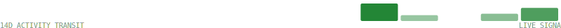

# <span style="color:#ff0000">𖢧ꛅ𖤢 ꚽꚳꛈ𖢧ꛕꛅ</span> · 🜂 QUANTUM SURFACE · v4.1

<p align="center">
  
  
</p>

<p align="center">
  
  
  
</p>

---

## ✨ Introduction
The Glitch is an experimental **systems engineering meta-surface** combining real-time telemetry, reversible automation, and signal integrity visualization.

---

## 🚀 Operational Access
<details>
<summary><b>◈ QUICK START / CLI ACCESS</b></summary>

```bash
# Clone and Hydrate
git clone [https://github.com/popdeuxrem/popdeuxrem.git](https://github.com/popdeuxrem/popdeuxrem.git)
cd popdeuxrem
pip install -r requirements.txt
python3 scripts/update_readme.py

</details>
🧬 Architecture & Deployments
<details>
<summary><b>◈ TOPOLOGY & VESSEL MANIFEST</b></summary>
System Topology
<p align="center">

</p>
Deployed Vessels
| Vessel | Description | Stack | Metrics | Status |
| :--- | :--- | :--- | :--- | :---: |
| **[iPhone-proxy-system](https://github.com/popdeuxrem/iPhone-proxy-system)** | No description provided. | `JavaScript` | ⭐ 0 🍴 0 | `ACTIVE` |
| **[popdeuxrem](https://github.com/popdeuxrem/popdeuxrem)** | PopdeuxRem | `Python` | ⭐ 0 🍴 0 | `ACTIVE` |
| **[Photext](https://github.com/popdeuxrem/Photext)** | No description provided. | `TypeScript` | ⭐ 0 🍴 0 | `ACTIVE` |
| **[pac-host](https://github.com/popdeuxrem/pac-host)** | No description provided. | `HTML` | ⭐ 0 🍴 0 | `ACTIVE` |
| **[lysergic-sass](https://github.com/popdeuxrem/lysergic-sass)** | No description provided. | `TypeScript` | ⭐ 0 🍴 0 | `ACTIVE` |

</details>
📊 Telemetry & Logic
<details>
<summary><b>◈ SYSTEM PERFORMANCE & SKILLS</b></summary>
<p align="center">


</p>
Capability Matrix

</details>
🛡 Security & Integrity
<details>
<summary><b>◈ AUDIT LOGS & VULNERABILITY REPORT</b></summary>
<p align="center">

</p>
> AUDIT_SUMMARY: 🛡️ SEC_AUDIT: DEGRADED | CRIT:0 HIGH:8 | STATUS: BREACH_RISK
> 
</details>
⚡ UPLINK
<details>
<summary><b>◈ CONTACT & SIGNATURE</b></summary>
contact:
  email: popdeuxrem@gateway.net
  github: "@popdeuxrem"
  status: accepting_critical_queries
  automation: ACTIVE

<div align="center">
<code>BUILD_SIG: 3b0a7d0 · <span style="color:#ff0000">𖢧ꛅ𖤢 ꚽꚳꛈ𖢧ꛕꛅ</span></code> · <code>2026-01-27 02:15:21 UTC</code>
<br />
<sub>Generated by QuantumProfileSurface/v4.1-AlertAware</sub>
</div>
</details>
