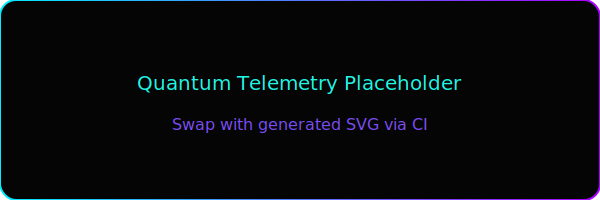

<!-- Version: v2.1.0 | Rollback Vector: git revert HEAD -->
<!-- zone:terminal:start -->

  <h1>👨‍💻 𖢧ꛅ𖤢ꚽꚳꛈ𖢧ꛕꛅ · Systems Artisan</h1>
  
Automation alchemist · DevOps polyglot · Terminal dreamer

  

  

    
  

---

### 🖥️ Terminal Snapshot
<pre>
Last login: 2025-05-07 02:51:55 on ttys000
𖢧ꛅ𖤢ꚽꚳꛈ𖢧ꛕꛅ@github ~ % uptime
2025-05-07 02:51:55 up 02:51, 1 user, load average: 0.58 0.63 0.44

𖢧ꛅ𖤢ꚽꚳꛈ𖢧ꛕꛅ@github ~ % ls -la Projects/
total 40
drwxr-xr-x  8 𖢧ꛅ𖤢ꚽꚳꛈ𖢧ꛕꛅ  staff  256 May 07 02:51 .
drwxr-xr-x  5 𖢧ꛅ𖤢ꚽꚳꛈ𖢧ꛕꛅ  staff  160 May 07 02:51 ..
drwxr-xr-x  7 𖢧ꛅ𖤢ꚽꚳꛈ𖢧ꛕꛅ  staff  224 May 07 02:51 DevOps
drwxr-xr-x  6 𖢧ꛅ𖤢ꚽꚳꛈ𖢧ꛕꛅ  staff  192 May 07 02:51 OpenSource
drwxr-xr-x  5 𖢧ꛅ𖤢ꚽꚳꛈ𖢧ꛕꛅ  staff  160 May 07 02:51 Scripts
-rw-r--r--  1 𖢧ꛅ𖤢ꚽꚳꛈ𖢧ꛕꛅ  staff  925 May 07 02:51 TODO.md

𖢧ꛅ𖤢ꚽꚳꛈ𖢧ꛕꛅ@github ~ % cat Projects/TODO.md
→ Automating deployment workflows
→ Contributing to open source
→ Learning Kubernetes
→ Building shell script utilities
𖢧ꛅ𖤢ꚽꚳꛈ𖢧ꛕꛅ@github ~ %
</pre>

  

<!-- zone:terminal:end -->

<!-- zone:mission:start -->
### 📋 Mission Deck
- 🔁 Automating resilient deployment meshes
- 🧪 Experimenting with Kubernetes, service meshes & GitOps
- 🛠️ Forging reusable shell utilities for day-2 ops
- 🌱 Documenting everything for the next explorer
<!-- zone:mission:end -->

<!-- dynamic:recent-activity:start -->
### 🛰️ Recent Signal Telemetry
- 🚀 [Thugger069/Thugger069](https://github.com/Thugger069/Thugger069/commits) · push update · 2025-11-12 10:32 UTC (18d ago)
- 📦 [Thugger069/Thugger069](https://github.com/Thugger069/Thugger069) · PR #3 closed · 2025-11-12 02:05 UTC (18d ago)
- 🚀 [Thugger069/Thugger069](https://github.com/Thugger069/Thugger069/commits) · push update · 2025-11-12 08:29 UTC (18d ago)
- 🚀 [Thugger069/Thugger069](https://github.com/Thugger069/Thugger069/commits) · push update · 2025-11-12 08:13 UTC (18d ago)
- 🚀 [Thugger069/Thugger069](https://github.com/Thugger069/Thugger069/commits) · push update · 2025-11-12 07:58 UTC (18d ago)
Last sync: 2025-11-30 12:54 UTC
<!-- dynamic:recent-activity:end -->

---

<!-- zone:badges-frontline:start -->
### 🧰 Frontline Toolkit

  
  
  
  
  
  
  
  
  
  
  
  
  
  
  

<!-- zone:badges-frontline:end -->

<!-- zone:badges-ops:start -->
### ⚙️ Backend & Ops Mesh

  
  
  
  
  
  
  
  
  
  
  
  
  

<!-- zone:badges-ops:end -->

<!-- zone:telemetry:start -->
### 🔭 Observability & Metrics

  
  
  

<!-- zone:telemetry-custom -->

  

<!-- zone:telemetry:end -->

<!-- zone:snake:start -->
### 🐍 Contribution Snake
<picture>
  <source media="(prefers-color-scheme: dark)" srcset="dist/github-snake-dark.svg?ts=2025-05-07T02%3A51%3A55" />
  <source media="(prefers-color-scheme: light)" srcset="dist/github-snake.svg?ts=2025-05-07T02%3A51%3A55" />
  
</picture>
<!-- zone:snake:end -->

<!-- zone:social:start -->
### 🤝 Signal Links

  
  
  
  

<!-- zone:social:end -->

<!-- zone:footer:start -->

  
  Last Updated: 2025-05-07 02:51:55 UTC · Integrity checksum: SHA256(README.md)

<!-- zone:footer:end -->
<!--
Quantum Basilica animated shell snippet (for future repo):

  

-->

